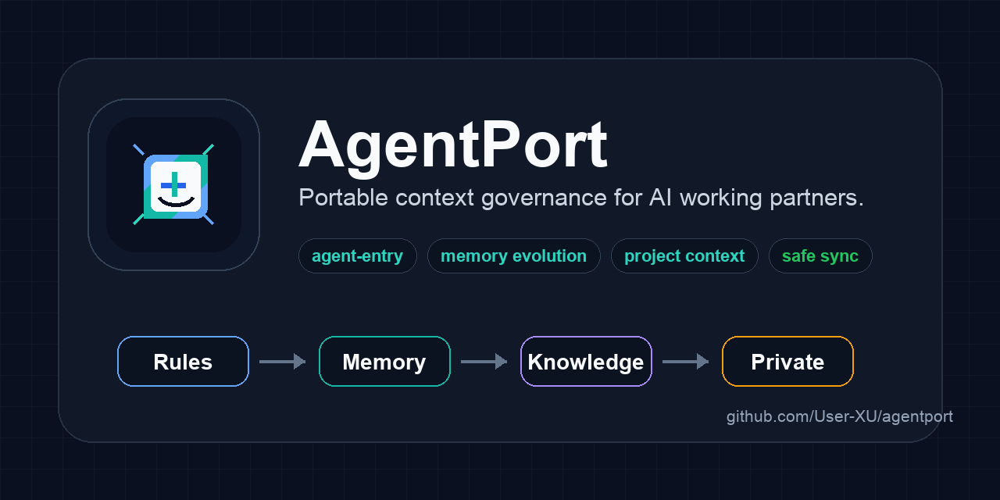
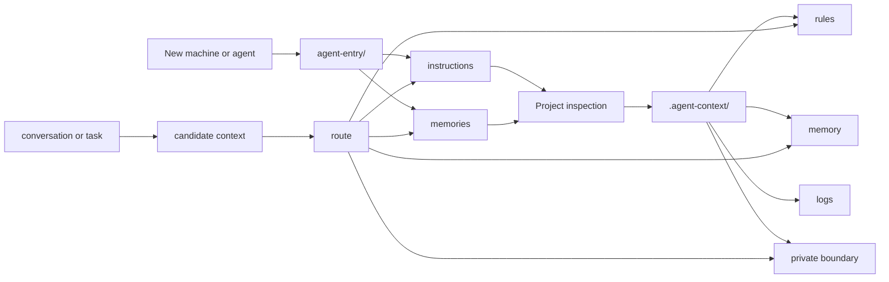

<p align="center">
  
</p>

<h1 align="center">AgentPort</h1>

<p align="center">
  Portable context governance for long-running AI working partners.
</p>

<p align="center">
  <a href="https://github.com/User-XU/agentport"></a>
  <a href="https://github.com/User-XU/agentport/blob/main/LICENSE"></a>
  
  
  <a href="https://github.com/User-XU/agentport/commits/main"></a>
</p>

<p align="center">
  <a href="#overview">Overview</a> ·
  <a href="#quick-start">Quick Start</a> ·
  <a href="#architecture">Architecture</a> ·
  <a href="docs/usage-recipes.md">Recipes</a> ·
  <a href="docs/comparison-with-openviking.md">OpenViking comparison</a> ·
  <a href="ROADMAP.md">Roadmap</a>
</p>

---

## Overview

AgentPort is a file-first system for making an AI working partner portable
across machines, repositories, and agent clients.

Most agent memory systems begin with storage. AgentPort begins with governance:
where rules live, where memories live, what is safe to sync, what must stay
private, and how a new agent should bootstrap itself without old chat history.

It gives you a small, Git-friendly structure for:

- **agent entry**: shared startup instructions for Codex, Claude, Hermes, and
  similar agents
- **memory evolution**: a policy for deciding what becomes durable memory
- **project context**: repository-local rules, memory, logs, and private
  boundaries
- **context audit**: checks for required files and likely secret leakage
- **portable bootstrap**: repeatable setup for new machines and new projects

AgentPort is not a vector database and not just a prompt template. It is the
context contract around your agents.

## Why AgentPort

| Common problem | AgentPort answer |
| --- | --- |
| A useful agent forgets you when you change machines | `agent-entry/` carries shared startup rules and memory modules |
| Global preferences get mixed with project rules | scope model: `global`, `public`, `project`, `private` |
| Chat summaries pretend to be durable memory | memory write gate and routing policy |
| Secrets drift into synced folders | private boundary plus audit scanner |
| Every repo invents agent instructions differently | reusable project template with `AGENTS.md`, `CLAUDE.md`, `HERMES.md` |

## Quick Start

Clone the repository:

```bash
git clone https://github.com/User-XU/agentport.git
cd agentport
```

Initialize a machine-level context workspace:

```bash
/opt/anaconda3/bin/python scripts/agentport.py init-machine --target ~/AgentContext
```

Initialize agent context inside a project:

```bash
/opt/anaconda3/bin/python scripts/agentport.py init-project --target /path/to/project
```

Audit context placement:

```bash
/opt/anaconda3/bin/python scripts/agentport.py audit --target /path/to/project --json
```

Route a candidate memory before storing it:

```bash
/opt/anaconda3/bin/python scripts/agentport.py route \
  --text "For this project, always run make verify before claiming completion."
```

Verify this repository:

```bash
make verify
```

## Architecture



### Context Scopes

| Scope | Purpose | Sync posture |
| --- | --- | --- |
| `global` | thin user-level defaults | user controlled |
| `public` | shared cross-agent rules and memories | safe to sync |
| `project` | repository-specific rules, memory, logs | commit with project |
| `private` | credentials, machine state, sensitive paths | local only |

### Repository Shape

```text
agentport/
  agent-entry/                  # canonical machine-level agent entry
  templates/project-context/    # project bootstrap files
  scripts/agentport.py          # unified CLI
  skills/agentport/             # optional agent skill adapter
  docs/                         # architecture, recipes, comparison
  tests/                        # stdlib unittest coverage
```

## CLI

| Command | Use |
| --- | --- |
| `init-machine` | copy root `agent-entry/` into a machine context workspace |
| `init-project` | create project-level agent context files |
| `audit` | check required files and likely secret leakage |
| `route` | classify candidate context before making it durable |

## Relationship To OpenViking

AgentPort is inspired by the same broad problem space as
[OpenViking](https://github.com/volcengine/OpenViking): agent context is
fragmented, hard to retrieve, and hard to evolve.

OpenViking approaches this as a context database. AgentPort approaches it as a
portable personal work system: Git-friendly files, explicit scopes, shared agent
entrypoints, project templates, and auditable memory evolution.

They can be complementary: AgentPort can define the human-readable source of
truth, while a future OpenViking-style backend could index and retrieve it.

## Status

AgentPort is alpha and intentionally local-first. The first release keeps the
core system simple: Markdown, Git, and Python standard library scripts.

Future stages may add MCP, indexing, visual inspection, or a richer retrieval
backend without replacing the file contracts.
