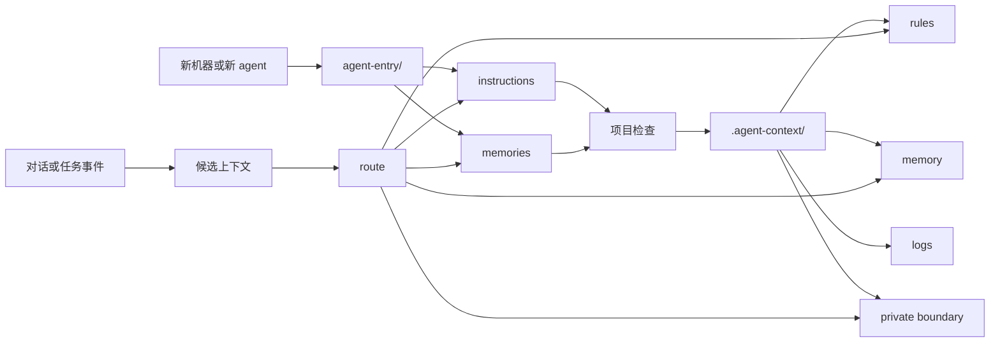

<p align="center">
  
</p>

<h1 align="center">AgentPort</h1>

<p align="center">
  面向长期协作 AI 工作伙伴的可迁移上下文治理系统。
</p>

<p align="center">
  <a href="https://github.com/User-XU/agentport"></a>
  <a href="https://github.com/User-XU/agentport/blob/main/LICENSE"></a>
  
  
  <a href="https://github.com/User-XU/agentport/commits/main"></a>
</p>

<p align="center">
  <a href="README.md">English</a> · 中文
</p>

<p align="center">
  <a href="#概览">概览</a> ·
  <a href="#快速开始">快速开始</a> ·
  <a href="#架构">架构</a> ·
  <a href="docs/usage-recipes.md">使用配方</a> ·
  <a href="docs/comparison-with-openviking.md">OpenViking 对比</a> ·
  <a href="ROADMAP.md">路线图</a>
</p>

---

## 概览

AgentPort 是一个 file-first 的上下文治理系统，用来让你的 AI 工作伙伴在不同机器、不同仓库、不同 agent 客户端之间保持连续性。

多数 agent memory 系统从“存储”出发。AgentPort 从“治理”出发：规则应该放在哪里，记忆应该放在哪里，哪些内容可以同步，哪些内容必须保持私有，以及一个新 agent 如何在没有旧聊天记录的情况下快速进入状态。

AgentPort 提供一套小而清晰、适合 Git 管理的结构，用于：

- **agent entry**：Codex、Claude、Hermes 等 agent 共用的启动入口
- **memory evolution**：判断什么内容值得沉淀为长期记忆的规则
- **project context**：项目级规则、记忆、日志和私有边界
- **context audit**：检查必需文件和潜在敏感信息泄漏
- **portable bootstrap**：新机器和新项目的可重复初始化流程

AgentPort 不是向量数据库，也不只是一个 prompt 模板。它是围绕 AI 工作伙伴建立的上下文契约。

## 为什么需要 AgentPort

| 常见问题 | AgentPort 的处理方式 |
| --- | --- |
| 换机器后，一个已经训练顺手的 agent 又像新人一样 | `agent-entry/` 携带共享启动规则和记忆模块 |
| 全局偏好、项目规则、临时总结混在一起 | 用 `global`、`public`、`project`、`private` 做作用域分层 |
| 聊天总结被误当成长期记忆 | 用 memory write gate 和 routing policy 先判断再沉淀 |
| token、路径、私有状态不小心进了同步目录 | 私有边界 + audit 扫描 |
| 每个项目都重新发明一套 agent 说明 | 提供可复用项目模板：`AGENTS.md`、`CLAUDE.md`、`HERMES.md` |

## 快速开始

克隆仓库：

```bash
git clone https://github.com/User-XU/agentport.git
cd agentport
```

初始化机器级上下文：

```bash
/opt/anaconda3/bin/python scripts/agentport.py init-machine --target ~/AgentContext
```

在项目中初始化 agent context：

```bash
/opt/anaconda3/bin/python scripts/agentport.py init-project --target /path/to/project
```

审计上下文放置是否合理：

```bash
/opt/anaconda3/bin/python scripts/agentport.py audit --target /path/to/project --json
```

在写入记忆前，对候选内容进行路由判断：

```bash
/opt/anaconda3/bin/python scripts/agentport.py route \
  --text "For this project, always run make verify before claiming completion."
```

验证本仓库：

```bash
make verify
```

## 架构



### 上下文作用域

| 作用域 | 用途 | 同步策略 |
| --- | --- | --- |
| `global` | 用户级基础偏好和少量默认约束 | 用户自行控制 |
| `public` | 多 agent 共用规则和稳定记忆 | 可同步 |
| `project` | 仓库级规则、记忆和日志 | 随项目提交 |
| `private` | 凭证、机器状态、敏感路径 | 仅本地保存 |

### 仓库结构

```text
agentport/
  agent-entry/                  # 机器级 agent 启动入口
  templates/project-context/    # 项目级上下文模板
  scripts/agentport.py          # 统一 CLI
  skills/agentport/             # 可选 agent skill 适配器
  docs/                         # 架构、使用配方、对比文档
  tests/                        # 标准库 unittest 测试
```

## CLI

| 命令 | 用途 |
| --- | --- |
| `init-machine` | 将根目录 `agent-entry/` 复制到机器级上下文工作区 |
| `init-project` | 创建项目级 agent context 文件 |
| `audit` | 检查必需文件和潜在敏感信息泄漏 |
| `route` | 在沉淀长期记忆前，对候选上下文进行分类 |

## 与 OpenViking 的关系

AgentPort 和 [OpenViking](https://github.com/volcengine/OpenViking) 关注的是同一个大问题：agent context 分散、难检索、难演化。

OpenViking 更像一个 context database。AgentPort 更像一套可迁移的个人 AI 工作系统：Git-friendly 文件、明确的作用域、共享 agent entry、项目模板和可审计的记忆演化流程。

两者可以互补：AgentPort 定义人可读、可审计的 source of truth；未来也可以接入 OpenViking 风格的后端来做索引和检索。

## 当前状态

AgentPort 目前处于 alpha 阶段，刻意保持 local-first。第一版只依赖 Markdown、Git 和 Python 标准库脚本。

后续可以加入 MCP、索引、可视化检查或更完整的检索后端，但不会替代当前的 file contracts。
